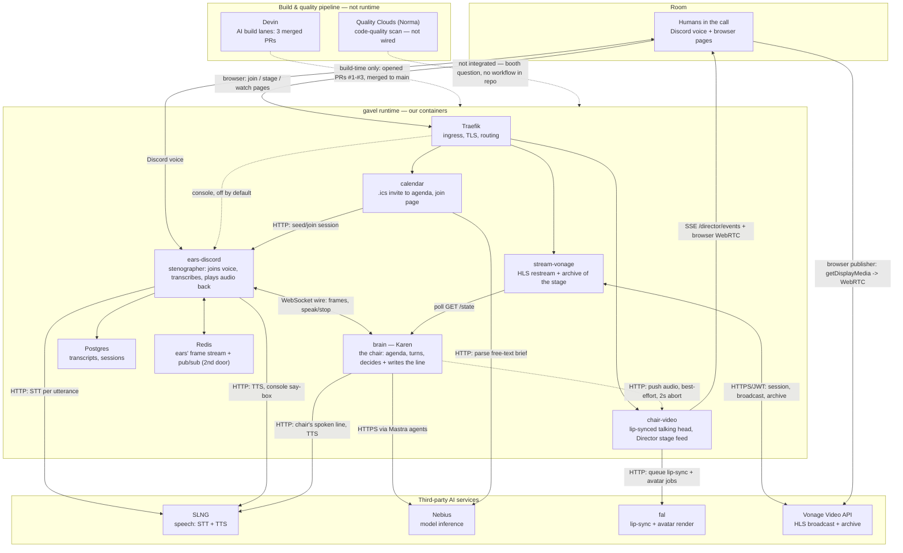

# gavel — architecture

One live meeting chair (Karen), one Discord/Vonage call, six sponsor services doing real
work in the runtime path, plus a build-time pipeline that shipped the code but never runs
in the loop.

## The graph

## The services

### gavel's own (runtime containers, from `compose.yaml`)

| Service | Role |
|---|---|
| **ears-discord** | Owns the Discord voice connection. Joins the channel, identifies who's speaking, transcribes via SLNG, records to Postgres, fans frames out over WebSocket (and Redis), plays the chair's audio back into the call. |
| **brain** | Karen, the chair. Tracks the floor, keeps the agenda, decides when to cut in, writes the line, turns it into speech via SLNG, pushes it to ears and to chair-video. Never touches a call SDK directly. |
| **calendar** | Turns a real `.ics` invite into the contract agenda and serves the join page that starts the session — the demo's opening beat. |
| **chair-video** | Turns the chair's spoken audio into a lip-synced talking head via fal, and drives the projector's live "Director" stage feed. Makes no decisions. |
| **stream-vonage** | Puts the live stage on Vonage Video as an HLS broadcast + archive, alongside the Discord call — never instead of it. |
| **Postgres** | Transcripts and session state. |
| **Redis** | ears' own frame stream and pub/sub — a second, optional door; the WebSocket wire works without it. |
| **Traefik** | Ingress: TLS termination and per-service routing (console gated by basic auth and off by default; calendar, chair-video, stream-vonage each get a narrow path set). |

### Third parties in the runtime path

| Service | Role he stated | Verified where |
|---|---|---|
| **SLNG** | Speech — TTS and STT | `packages/ears-discord/src/ears/stt.py:33` (STT), `tts.py:32` (console TTS); `packages/brain/src/chair/tts.ts:35` + `main.ts:35` (the chair's own voice) |
| **Nebius** | Model inference | `packages/brain/src/chair/mastraLlm.ts:2` (chair, via Mastra) and `packages/calendar/src/gavel_calendar/llm.py:65` (brief parsing) — two independent consumers |
| **Mastra** | Backend orchestration | `packages/brain/package.json` (`@mastra/core`), `packages/brain/src/mastra/` (chair/relevance/digest agents, intervene workflow), wired in `main.ts` |
| **fal** | Director WebRTC avatar | `packages/chair-video/src/chair_video/fal.py` — queue-poll HTTP client, called from `app.py`, triggered by brain's `pushToStage` (`engine.ts:50,813`) |
| **Vonage** | Streaming | `packages/stream-vonage/src/stream_vonage/vonage.py` — Vonage **Video API** (JWT app-id/private-key, or legacy api-key/secret), session + HLS broadcast + archive |

### Build & quality pipeline — not part of the runtime graph

| Service | Role he stated | Status |
|---|---|---|
| **Devin** | AI build lanes | **Build-time, not runtime.** Three PRs merged to `main` (commits tagged `#1`, `#2`, `#3` in `git log`: chair eval harness, calendar recurring-event expansion, chair line-length fix). `DEVIN_PAT_KEY`/`DEVIN_ORG_ID` exist in `.env.example` but no running service calls them — confirmed in `DEPLOYMENT.md:175`: "not used by any service; agent-orchestration API only." |
| **Quality Clouds** ("Norma") | Code-quality validation and fixes | **Not wired.** No `.github/workflows/` directory, no client code anywhere in the repo. `docs/QUALITY.md` treats it as an open booth question — their published product targets Salesforce/ServiceNow/Dynamics/Magento, and whether it scans a plain Python/JS repo at all was still unconfirmed at time of writing. Note: the repo and Vitaly's docs call it "Quality Clouds"; "Norma" doesn't appear anywhere in the codebase. |

## Notes for the honest slide

- **fal is HTTP, not WebRTC** — the WebRTC leg is the browser stage page's own `RTCPeerConnection`
  (`packages/chair-video/src/chair_video/director.py:3`), fed by an SSE command channel
  (`/director/events`, `app.py:265`). fal itself is a queue-and-poll REST API.
- **Vonage is wired in code, unexercised live** — `vonage.py` notes the service doesn't yet have
  Video API credentials to test against a real project.
- `ears-vonage` and `concierge` exist as packages but are **not** in `compose.yaml` (concierge is
  explicitly "parked"; ears-vonage has no compose service) — left off this diagram because they
  are not currently wired, matching the "no service that isn't really wired" rule.
