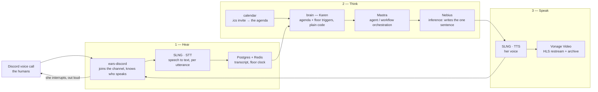

# gavel — architecture

An AI chair ("Karen") that sits in a real Discord call: she hears the room, decides when
someone has had the floor too long, and says so out loud.

Two parts: **the live path** (what runs during a meeting) and **off the live path** (what
built the code and proved the chair says something sane).

---

## 1. The live path — Hear → Think → Speak

**The three moves**

| # | Move | What happens |
|---|---|---|
| 1 | **Hear** | `ears-discord` holds the voice connection and knows who is speaking. **SLNG** transcribes each utterance live. Postgres and Redis keep the transcript and the floor clock. |
| 2 | **Think** | `brain` is Karen. Plain code holds the agenda and fires on facts, not vibes — 60% of the floor, a topic over budget, a must-hear attendee still silent. **Mastra** orchestrates the model calls; **Nebius** writes the one sentence she says: under 20 words, names the person, hands the floor somewhere specific. `calendar` turned a real `.ics` invite into that agenda before the meeting started. |
| 3 | **Speak** | **SLNG** turns the line into her voice, `ears-discord` plays it back into the live call — the room hears her interrupt. **Vonage Video** restreams the meeting as HLS with an archive for anyone not in the call. |

Underneath: five containers behind Traefik on one VPS — `ears-discord`, `brain`, `calendar`,
`stream-vonage`, Postgres/Redis. Every seam is HTTP or a WebSocket, so any one
of them can be swapped without touching the others.

**Sponsors in the live path:** SLNG (speech), Nebius (inference), Mastra (orchestration),
Vonage (streaming).

---

## 2. Off the live path — what built it, what checked it

None of these run during a meeting.

| Service | Role | Outcome |
|---|---|---|
| **Devin** | Autonomous build lanes, working in parallel with us | Ran its own branches and opened PRs like a teammate. **3 PRs merged into main** — shipped code, not a demo. |
| **Quality Clouds ("Norma")** | AI code-quality analysis over the repository | Scanned gavel, returned concrete findings. **Findings fixed in the codebase** before freeze — the scan changed the code. |
| **Galtea** | Evals of the one model-shaped output: the sentence she says | Ten frozen cases (floor hog at 62% and 81%, topic over budget, a silent must-hear attendee, 15s of dead air). Traces sent up and scored on: names the right person, under 20 words, hands the floor somewhere real, polite enough to survive a real meeting, invents nothing it never heard. **Scored runs, not guesses.** |
| **Langfuse** | Observability on every model call, via Mastra's exporter | One trace session per meeting — a bad interruption can be read back to the exact prompt and state that produced it. **The chair is debuggable.** Wired in `brain`, on when the keys are set. |

**The split that matters:** *whether* to interrupt is plain code, unit-tested against a
scripted replay. Only *what she says* goes to a model — so only that needs evals.

---

## 2b. Before the meeting — the agenda gate

`calendar` is where the agenda comes from, and it is the first place the chair says no.

1. The host dictates a brief into `/compose` — one box, no form, no invitee list.
2. A Nebius model turns that brief into a title, a purpose, a start, a duration and a list
   of topics with owners, time budgets and who must be heard.
3. **If it comes back with no topics, the invite does not go out.** The page says so and
   asks the one question that is missing — what does this call have to decide? Measured
   19 Sep: five different agenda-less briefs, five empty topic arrays, five refusals.
4. What lands in the invitees' mailboxes is the *agenda*, not the dictated paragraph:
   a purpose line, then every topic numbered with its owner, its minutes, and the people
   who have to be heard on it. The same structure goes into the `.ics` DESCRIPTION.

That is the whole reason the in-call triggers have anything to enforce: a topic budget and
a must-be-heard list exist before anybody joins.

---

The projector version of this page is `docs/architecture.html` — three full-screen slides, served at `/architecture`. Arrow keys, space, click or swipe to move.

---

## 3. Where this goes — strategy & go-to-market

**Discord was the harness, not the product.** We built on it because it puts a bot into a live
voice call in an afternoon. Nothing about the chair depends on it: `ears-discord` is the only
container that knows what a voice call is, and everything else talks HTTP. Swapping the platform
means one new adapter against the same wire — agenda, floor clock, triggers and voice
untouched.

**The target is the enterprise meeting stack**, as an add-on inside the suite people already buy:

| Platform | Route in |
|---|---|
| **Google Meet** | Workspace add-on, next to Calendar — where the agenda already comes from |
| **Zoom** | Zoom App + bot SDK; the meeting-heavy install base and the clearest pain |
| **Microsoft Teams** | The suite play: sold with M365, not alongside it |

**Why it lands:**

- **The agenda already exists** — it is the calendar invite the organiser sent. Nobody retypes it.
- **She acts inside the hour** — a chair who interrupts at minute 12 beats a summary at minute 61.
- **It leaves a record with numbers** — floor time per person, per topic, per meeting. The first
  honest data most orgs have on where the hour went.

Not another meeting-notes bot. The category is **time governance**: who gets heard, what gets
decided, whether the hour was worth its payroll cost — live, while it can still be changed.

**Roadmap**

| Phase | What | Detail |
|---|---|---|
| **Now — demo** | Discord, one room | Live chair, real interruptions. Proves the loop closes end to end. |
| **Next — wedge** | Meet & Zoom adapters | Same brain, new ears. Land with teams whose standups and reviews already overrun, priced per room. |
| **Then — suite** | Teams add-on, org-wide | Chairing plus scheduling and agenda hygiene across the org, with the time data to show what it saved. |
